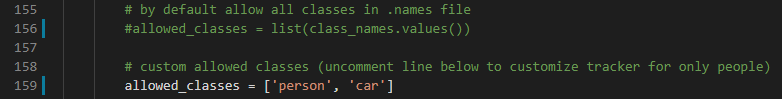

# yolov4-deepsort
[](LICENSE)
[](https://colab.research.google.com/drive/1zmeSTP3J5zu2d5fHgsQC06DyYEYJFXq1?usp=sharing)

Seguimiento de objetos implementado con YOLOv4, DeepSort y TensorFlow. YOLOv4 es un algoritmo de última generación que utiliza redes neuronales convolucionales profundas para realizar detecciones de objetos. Podemos tomar la salida de YOLOv4 para alimentar estas detecciones de objetos en Deep SORT (Seguimiento simple en línea y en tiempo real con una métrica de asociación profunda) para crear un rastreador de objetos de alta precisión.

## Demostración del rastreador de objetos en personas
<p align="center"></p>

## Demostración del rastreador de objetos en automóviles
<p align="center"></p>

## Empezando
Para comenzar, instale las dependencias adecuadas a través de Anaconda o Pip. Recomiendo la ruta Anaconda para las personas que usan una GPU, ya que configura la versión del kit de herramientas CUDA para usted.

### Conda (Recomendado)

```bash
# Tensorflow CPU
conda env create -f conda-cpu.yml
conda activate yolov4-cpu

# Tensorflow GPU
conda env create -f conda-gpu.yml
conda activate yolov4-gpu
```

### Pip
(TensorFlow 2 packages require a pip version >19.0.)
```bash
# TensorFlow CPU
pip install -r requirements.txt

# TensorFlow GPU
pip install -r requirements-gpu.txt
```
### Nvidia Driver (Para GPU, si no está utilizando Conda Environment y aún no ha configurado CUDA)
Asegúrate de usar CUDA Toolkit versión 10.1, ya que es la versión adecuada para la versión de TensorFlow que se usa en este repositorio.
https://developer.nvidia.com/cuda-10.1-download-archive-update2

## Bajando pesos pre-entrenados de YOLOv4 
Nuestro rastreador de objetos usa YOLOv4 para realizar las detecciones de objetos, que luego utiliza la clasificación profunda para rastrear. Existe un modelo oficial de detector de objetos YOLOv4 previamente entrenado que es capaz de detectar 80 clases. Para una demostración sencilla, usaremos los pesos pre-entrenados para nuestro rastreador.
Descargue el archivo yolov4.weights previamente entrenado: https://drive.google.com/open?id=1cewMfusmPjYWbrnuJRuKhPMwRe_b9PaT

Copie y pegue yolov4.weights de su carpeta de descargas en la carpeta 'data' de este repositorio.

Si desea utilizar yolov4-tiny.weights, un modelo más pequeño que es más rápido en la ejecución de detecciones pero menos preciso, descargue el archivo aquí: https://github.com/AlexeyAB/darknet/releases/download/darknet_yolo_v4_pre/yolov4-tiny.weights

## Ejecución del rastreador con YOLOv4
Para implementar el seguimiento de objetos usando YOLOv4, primero convertimos el .weights en el modelo de TensorFlow correspondiente que se guardará en una carpeta de puntos de control. Luego, todo lo que tenemos que hacer es ejecutar el script object_tracker.py para ejecutar nuestro rastreador de objetos con YOLOv4, DeepSort y TensorFlow.
```bash
# Convertir pesos de darknet en modelo de tensorflow
python save_model.py --model yolov4 

# Ejecute el rastreador de objetos de ordenación profunda yolov4 en el video
python object_tracker.py --video ./data/video/test.mp4 --output ./outputs/demo.avi --model yolov4

# Ejecute el rastreador de objetos de ordenación profunda yolov4 en la cámara web (establezca la marca de video en 0)
python object_tracker.py --video 0 --output ./outputs/webcam.avi --model yolov4
```
La bandera de salida le permite guardar el video resultante del rastreador de objetos en ejecución para que pueda volver a verlo más tarde. El video se guardará en la ruta que establezca. (¡La carpeta de salidas es donde estará si ejecuta el comando anterior!)

Si desea ejecutar yolov3, configure el indicador del modelo en `` --model yolov3 `` , cargue yolov3.weights en la carpeta 'datos' y ajuste el indicador de pesos en los comandos anteriores. (vea todos los indicadores de línea de comando disponibles y sus descripciones en una sección a continuación)

## Ejecución del rastreador con YOLOv4-Tiny
Los siguientes comandos le permitirán ejecutar yolov4-tiny model. Yolov4-tiny le permite obtener una velocidad más alta (FPS) para el rastreador a un pequeño costo de precisión. ¡Asegúrese de haber descargado el archivo de pesos diminutos y agregarlo a la carpeta 'datos' para que los comandos funcionen!
```
# guardar modelo yolov4-tiny
python save_model.py --weights ./data/yolov4-tiny.weights --output ./checkpoints/yolov4-tiny-416 --model yolov4 --tiny

# Ejecute el rastreador de objetos yolov4-tiny
python object_tracker.py --weights ./checkpoints/yolov4-tiny-416 --model yolov4 --video ./data/video/test.mp4 --output ./outputs/tiny.avi --tiny
```

## Video resultante
Como se mencionó anteriormente, el video resultó se guardará en el lugar donde establezca el `` --output ``  ruta de la bandera de línea de comando a. Siempre lo configuro para guardar en la carpeta 'outputs'. También puede cambiar el tipo de video guardado ajustando el indicador `` --output_format `` , por defecto está configurado en el códec AVI que es XVID.

Video de ejemplo que muestra el seguimiento de todas las clases de conjuntos de datos de coco:
<p align="center"></p>

##Clases de filtro que son rastreadas por Object Tracker
De forma predeterminada, el código está configurado para rastrear las aproximadamente 80 clases del conjunto de datos de coco, que es en lo que se entrena el modelo YOLOv4 previamente entrenado. Sin embargo, puede ajustar fácilmente algunas líneas de código para rastrear cualquier 1 o combinación de las 80 clases. Es muy fácil filtrar solo la clase `` person`` o solo la clase `` car ``, que son las más comunes.

Para filtrar una selección personalizada de clases, todo lo que necesita hacer es comentar la línea 159 y descomentar la línea 162 de[object_tracker.py](https://github.com/theAIGuysCode/yolov4-deepsort/blob/master/object_tracker.py) Dentro de la lista de "clases permitidas", simplemente agregue las clases que desee que rastree el rastreador. Las clases pueden ser cualquiera de las 80 en las que se entrena el modelo, vea qué clases puede rastrear en el archivo [data/classes/coco.names](https://github.com/theAIGuysCode/yolov4-deepsort/blob/master/data/classes/coco.names)

Este ejemplo permitiría realizar un seguimiento de las clases para personas y automóviles.
<p align="center"></p>

### Demostración de Object Tracker configurado para rastrear solo la clase 'person'
<p align="center"></p>

### Demostración de Object Tracker configurado para rastrear solo la clase 'car'
<p align="center"></p>

## Referencia de argumentos de la línea de comandos

```bash
save_model.py:
  --weights: path to weights file
    (default: './data/yolov4.weights')
  --output: path to output
    (default: './checkpoints/yolov4-416')
  --[no]tiny: yolov4 or yolov4-tiny
    (default: 'False')
  --input_size: define input size of export model
    (default: 416)
  --framework: what framework to use (tf, trt, tflite)
    (default: tf)
  --model: yolov3 or yolov4
    (default: yolov4)
    
 object_tracker.py:
  --video: path to input video (use 0 for webcam)
    (default: './data/video/test.mp4')
  --output: path to output video (remember to set right codec for given format. e.g. XVID for .avi)
    (default: None)
  --output_format: codec used in VideoWriter when saving video to file
    (default: 'XVID)
  --[no]tiny: yolov4 or yolov4-tiny
    (default: 'false')
  --weights: path to weights file
    (default: './checkpoints/yolov4-416')
  --framework: what framework to use (tf, trt, tflite)
    (default: tf)
  --model: yolov3 or yolov4
    (default: yolov4)
  --size: resize images to
    (default: 416)
  --iou: iou threshold
    (default: 0.45)
  --score: confidence threshold
    (default: 0.50)
  --dont_show: dont show video output
    (default: False)
  --info: print detailed info about tracked objects
    (default: False)
```

### Referencias

   Un gran saludo va para hunglc007 y nwojke por crear la columna vertebral de este repositorio:
  * [tensorflow-yolov4-tflite](https://github.com/hunglc007/tensorflow-yolov4-tflite)
  * [Deep SORT Repository](https://github.com/nwojke/deep_sort)
